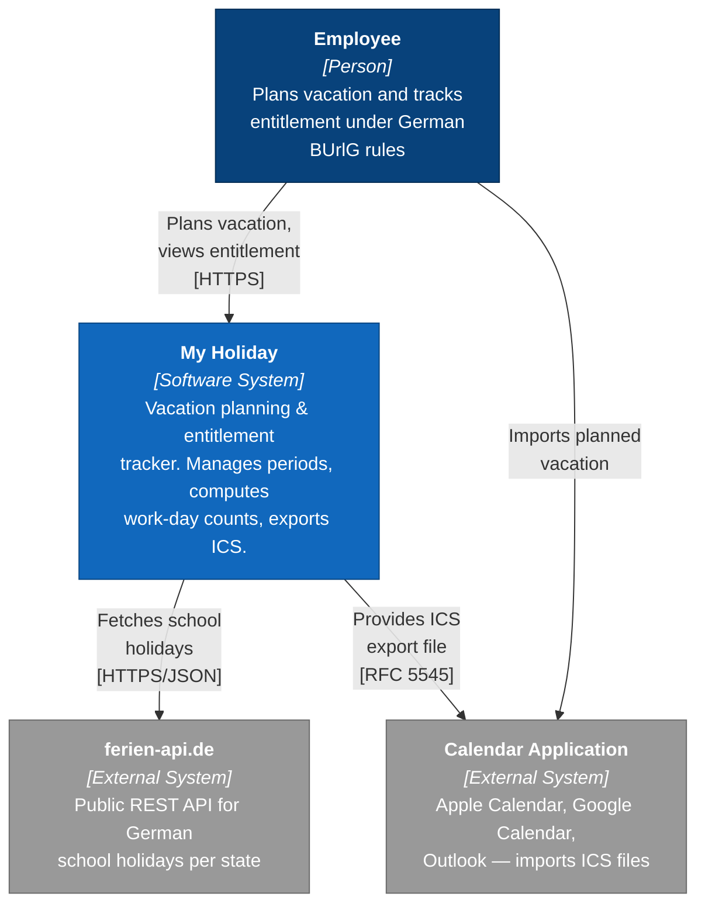
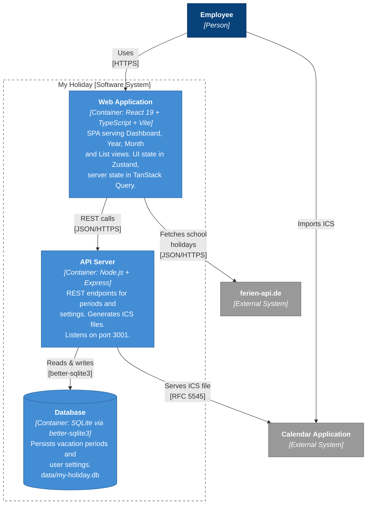

# Architecture

## Tech Stack

| Layer | Technology |
|---|---|
| Frontend | React 19 + TypeScript |
| Build | Vite |
| State | Zustand (UI state: view, year, theme, language) |
| Data | TanStack Query + REST API |
| Backend | Express + better-sqlite3 (SQLite, port 3001) |
| Holidays | `feiertagejs` (public holidays) + ferien-api.de (school holidays) |
| Styling | Plain CSS with custom properties, per-component CSS files |
| Routing | None — tab-based view switching |
| Tests | Vitest (unit/integration) + Playwright (E2E) |

## System Overview (C4)

### Level 1 — System Context



### Level 2 — Containers



## Project Structure

```
src/
├── types.ts                   # Shared TypeScript interfaces
├── api/
│   ├── client.ts              # REST API fetch wrappers
│   └── hooks.ts               # TanStack Query hooks
├── data/
│   ├── holidays.ts            # feiertagejs wrapper + GermanState
│   └── schoolHolidays.ts      # Dynamic school holidays (ferien-api.de)
├── utils/
│   ├── calendar.ts            # Work-day counting, half-day logic
│   ├── entitlement.ts         # Pro-rata entitlement & leave reduction (§ 4/§ 17 BUrlG)
│   ├── export.ts              # CSV export/import (handwritten parser)
│   └── ics.ts                 # RFC 5545 iCalendar generator
├── i18n/
│   ├── translations.ts        # All DE + EN strings as a typed nested object
│   └── useT.ts                # useT() hook — returns t(key, params?) function
├── state/
│   └── store.ts               # Zustand store (UI-only: view, year, theme, language, undo/redo)
├── components/
│   ├── Nav.tsx                # Navigation + import/export + settings
│   ├── Dashboard.tsx          # Stats, progress bars, upcoming list
│   ├── YearView.tsx           # 12-month grid with mini calendars
│   ├── MonthView.tsx          # Full calendar with click-to-select
│   ├── ListView.tsx           # Sortable table of all periods
│   ├── VacationModal.tsx      # Add/edit form with type selector
│   ├── SettingsModal.tsx      # Settings: state, days, theme, language
│   ├── FirstRunWizard.tsx     # 4-step onboarding modal
│   └── Toast.tsx              # Undo notifications
├── App.tsx                    # Root component + theme management
├── App.css                    # Layout + responsive styles only
├── index.css                  # Design tokens + global reset
└── main.tsx                   # Entry point (QueryClientProvider + I18nProvider)

server/
├── index.ts                   # Express server (port 3001)
├── routes.ts                  # REST routes + ICS endpoint
├── db.ts                      # SQLite schema + CRUD operations
└── types.ts                   # Server-specific types

scripts/
└── migrate-v1.ts              # v1 CSV → v2 SQLite (idempotent)

e2e/
└── smoke.spec.ts              # Playwright E2E smoke tests
```

## Request Flow

A typical "save vacation" action traces through the stack as follows:

```
User clicks "Plan Vacation" in VacationModal
  → useCreatePeriod() hook  (src/api/hooks.ts)
  → POST /api/v1/periods    (src/api/client.ts)
  → routes.ts               (Express route handler)
  → db.ts insertPeriod()    (better-sqlite3)
  → 201 JSON response
  → TanStack Query invalidates 'periods' query
  → Dashboard / YearView / MonthView re-render with fresh data
```

Settings changes follow the same pattern via `PUT /api/v1/settings`. Read-only views (Year, Month, List) use `GET /api/v1/periods?year=YYYY` which TanStack Query caches and reuses.

---

## REST API

| Method | Endpoint | Description |
|--------|----------|-------------|
| `GET` | `/api/v1/periods?year=YYYY` | List periods for a year |
| `POST` | `/api/v1/periods` | Create a vacation period |
| `PUT` | `/api/v1/periods/:id` | Update a period |
| `DELETE` | `/api/v1/periods/:id` | Delete a period |
| `GET` | `/api/v1/settings` | Get all settings |
| `PUT` | `/api/v1/settings` | Update settings |
| `GET` | `/api/v1/export.ics?year=YYYY` | Download iCalendar file |

Period endpoints (`POST`, `PUT`, `GET /periods`) use the `VacationPeriod` shape (see Data Model below). The settings endpoints use the flat settings object (`totalDays`, `state`, `carryOverDays`, `carryOverDeadline`, `carryOverMaxDays`, `bildungsurlaubDays`, employment dates). `DELETE` and the ICS endpoint return no body on success.

All data is persisted to `data/my-holiday.db` (SQLite, gitignored).

## Data Model

```typescript
VacationType = 'urlaub' | 'bildungsurlaub' | 'kur' | 'sabbatical'
  | 'unbezahlterUrlaub' | 'mutterschaftsurlaub' | 'elternzeit' | 'sonderurlaub'

VacationPeriod {
  id: string;          // UUID (crypto.randomUUID())
  startDate: string;   // ISO date YYYY-MM-DD
  endDate: string;     // ISO date YYYY-MM-DD
  note: string;
  halfDay?: boolean;   // Single-day half-day booking
  type?: VacationType; // Defaults to 'urlaub'
  changedAt: string;   // ISO timestamp, updated on every edit
}
```

## State Flow

- **TanStack Query** manages server state: periods and settings are fetched from and mutated via the REST API
- **Zustand** manages local UI state: active view, selected year/month, theme, language, undo/redo stacks
- TanStack Query automatically invalidates and refetches period/setting queries after mutations
- Work-day counts are **derived** (computed on render) — never stored, guaranteeing correctness

## Key Design Decisions

**1. Server-backed persistence**

All vacation data and settings are stored in a local SQLite database. The Express backend exposes a REST API consumed by the frontend via TanStack Query. No localStorage, no manual sync.

**2. Work-day counting is live-computed**

`countVacationWorkDays()` iterates day-by-day applying weights: 1.0 for normal work days, 0.5 for user half-days, 0.5 for Dec 24/31, 0 for weekends and holidays. Never stored — always correct.

**3. Per-component CSS files**

Styles are split into co-located CSS files (`Nav.css`, `Dashboard.css`, `Calendar.css`, etc.). Design tokens live in `index.css`. No CSS-in-JS — keeps the bundle small.

**4. View switching without a router**

Four views share one URL. The active view is in Zustand state. No routing complexity for a single-screen tool.

**5. Pro-rata vacation entitlement (§ 4 BUrlG)**

Full entitlement after 6 complete months of employment in a year; otherwise 1/12 per complete month worked. Leave reductions (§ 17) apply for unpaid leave and parental leave.

**6. Handwritten i18n (no library)**

Translations live in `src/i18n/translations.ts` as a typed nested object with `de` and `en` keys. The `useT()` hook (in `src/i18n/useT.ts`) returns a `t(key, params?)` function; `I18nProvider` in `main.tsx` wraps the app. No external i18n library is used — the vocabulary is small and the handwritten approach avoids bundle weight, complex plural rules, and build tooling. String interpolation uses `{param}` placeholders replaced at call time.

**7. Idempotent CSV migration**

The migration script (`scripts/migrate-v1.ts`) matches periods by composite key `(startDate, endDate, note, halfDay, type)`. Rerunning safely skips existing records.
