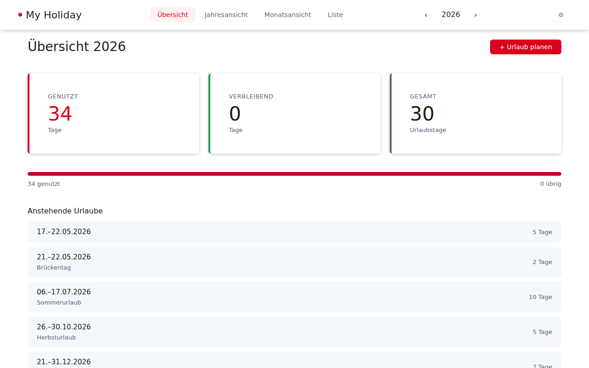
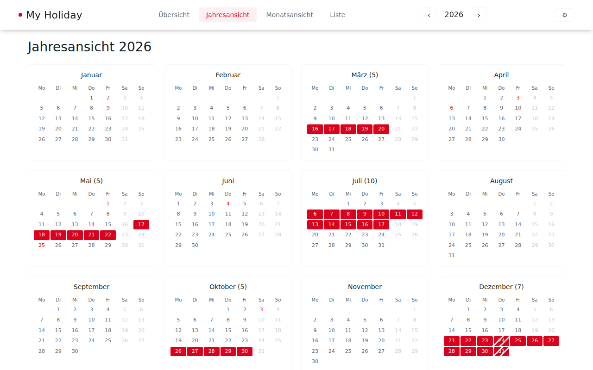

# My Holiday — Urlaubsplaner

A vacation day planner for Germany. Plan your annual vacation days with automatic work-day calculation that excludes weekends and public holidays for your chosen state (Bundesland).

> **Security notice:** My Holiday has **no built-in authentication**. It is designed for single-user, localhost or home-network use only. Do not expose it to the internet without placing an authenticating reverse proxy (e.g. nginx + HTTP Basic Auth, Authelia, or similar) in front of it.

## Screenshots
### Dashboard


### Year Grid


## Features

### Planning & Tracking

- **Configurable budget** — set your annual vacation allowance (default: 30 days)
- **Carry-over tracker** — enter days carried over from last year; Dashboard shows usage, warnings when the March 31 deadline approaches
- **First-run wizard** — onboarding collects employment dates, Bundesland, vacation days, and carry-over policy
- **Half-day booking** — mark single days as half days (0.5); Dec 24 and Dec 31 always count as 0.5
- **Smart work-day counting** — only Monday–Friday, excludes weekends and public holidays; multi-year periods are correctly clipped
- **Live work-day preview** — modal shows exactly how many work days a date range consumes
- **Overlap prevention** — prevents booking conflicting vacations

### Views

- **Four views** — Dashboard summary, year grid (12 mini calendars), full month calendar, sortable list
- **Click-to-plan** — select date ranges directly in the month view; click existing vacations to edit or delete

### Data & Export

- **CSV import/export** — backup your data or edit it in Excel; semicolon-delimited UTF-8 with BOM
- **iCal export** — downloadable `.ics` files for calendar apps (Apple Calendar, Outlook, Google Calendar)
- **School holidays** — overlay showing school breaks for your state (fetched from ferien-api.de)

### Localisation & Accessibility

- **All 16 German states** — select your state; public holidays computed via [`feiertagejs`](https://www.npmjs.com/package/feiertagejs)
- **8 vacation types** — Vacation, Educational Leave, Spa / Rehab, Sabbatical, Unpaid Leave, Maternity Leave, Parental Leave, Special Leave with colour-coded badges and separate Educational Leave budget
- **Dark mode** — light, dark, or auto (follows system preference)
- **English & German** — switch language in settings
- **Responsive** — works on desktop, tablet, and mobile

## Setup

**Quickstart:** `docker-compose up` then open **http://localhost:3001** — no other steps needed. See the [Docker](#docker) section for full options including manual `docker run`.

Or run locally with npm:

```bash
npm install

# Start the backend (Express + SQLite, port 3001)
npm run server

# Start the frontend (Vite dev server, port 5173)
npm run dev
```

The frontend talks to the backend via REST API. Both must be running.

### Configuration

The backend reads these environment variables on startup:

| Variable | Default | Purpose |
|---|---|---|
| `API_HOST` | `127.0.0.1` | Network interface to bind. Loopback by default — the API is **not** reachable from other devices on your LAN. Set to `0.0.0.0` to expose on all interfaces (only do this if you've added authentication). |
| `API_PORT` | `3001` | TCP port |
| `DB_PATH` | `data/my-holiday.db` | SQLite database file path |
| `CORS_ORIGIN` | reflect any origin | Restrict cross-origin access in production, e.g. `CORS_ORIGIN=http://localhost:5173` |

Example — expose to LAN with a custom port:

```bash
API_HOST=0.0.0.0 API_PORT=4000 npm run server
```

## Docker

The easiest way to run the app on a server, NAS, or Raspberry Pi.

```bash
# Build and start (data persisted in ./data/)
docker-compose up

# Or without Compose
docker build -t my-holiday .
mkdir -p data
docker run -p 3001:3001 \
  -v $(pwd)/data:/app/data \
  -e DB_PATH=/app/data/my-holiday.db \
  -e API_HOST=0.0.0.0 \
  my-holiday
```

Open **http://localhost:3001** — the container serves both the frontend and the API on a single port.

The SQLite database is stored in `./data/my-holiday.db` on the host. Removing and recreating the container leaves your data intact.

## How to Use

### Views

| Tab | What it does |
|---|---|
| **Overview** | Summary cards (used, remaining, total days), progress bar, carry-over tracker, Educational Leave counter, upcoming vacations — click any entry to edit |
| **Year View** | 12 mini month calendars. Vacation days are filled red, half days have a striped pattern, public holidays in red text. Click a month to jump to its detail view |
| **Month View** | Full-size calendar for a single month. Navigate with `‹` `›` arrows. Public holidays labeled, school holidays shown with stripes |
| **List** | Sortable table of all vacation periods with date range, work-day count, note, type badge, and edit/delete buttons |

### Settings

Click the ⚙️ gear icon to open settings:

- **Vacation Days per Year** — annual budget (1–60, default: 30)
- **Carry-over from Last Year (Days)** — carry-over days; auto-calculated on year switch, manually overridable (0–60)
- **State** — determines public holidays for your region (default: Hessen)
- **Color Scheme** — light, dark, or auto
- **Language** — Deutsch or English

### Adding a vacation

1. Click **+ Plan Vacation** (Dashboard or List view), or in **Month View** click a start date then an end date
2. Enter an optional note (e.g. "Sommerurlaub")
3. Choose a **vacation type** from the dropdown (default: Vacation)
4. Toggle **Half Day (½ work day)** for single-day bookings
5. The modal shows the live work-day count; overlapping vacations are blocked
6. Click **Plan Vacation** to save

### Vacation types

| Type | Budget impact |
|------|--------------|
| Vacation | Consumes main vacation budget |
| Educational Leave | Separate counter (must be enabled in settings) |
| Spa / Rehab, Sabbatical, Maternity Leave, Special Leave | Informational only |
| Unpaid Leave, Parental Leave | Reduces vacation entitlement (§ 17 BUrlG) |

### Half-day rules

| Rule | Counts as |
|------|-----------|
| User-toggled "Half Day (½ work day)" (single day only) | 0.5 |
| December 24 (Christmas Eve) | 0.5 |
| December 31 (New Year's Eve) | 0.5 |
| Normal work day | 1.0 |
| Weekend or public holiday | 0 |

### Carry-over tracker

Carry-over days from the previous year must be used by **March 31** (some contracts allow June 30 — configurable in the first-run wizard).

**Automatic calculation:** switching years computes carry-over as `max(0, annual budget − days used in previous year)`.

**Dashboard:** progress bar shows consumed vs. remaining carry-over days, with:
- ⚠️ **Warning** — ≤30 days until deadline with unused days
- ❌ **Expired** — deadline passed with unused days (shown in red)

Carry-over days are "used first": vacations before March 31 consume the carry-over bucket before the regular budget.

### Editing or deleting

- Click any upcoming vacation on the **Dashboard** to open the edit modal
- Click any vacation block in the **month view** to edit
- Use ✎ (edit) and ✕ (delete) buttons in the **list view** or month view's vacation list
- All changes persist to the database immediately

### Changing years

Use the `‹ 2026 ›` arrows in the navigation bar. Data is stored per year — switch freely without losing plans.

### Import / Export

- **📤 Export** — downloads `urlaub-2026.csv` with columns: `Start Date;End Date;Note;Type;Half Day;Work Days` (type exported as internal key, e.g. `urlaub`, `bildungsurlaub`)
- **📥 Import** — reads CSV (semicolon-delimited, UTF-8). Accepts `YYYY-MM-DD`, `DD.MM.YYYY`, and `MM/DD/YYYY` date formats. Valid `Type` values: `urlaub`, `bildungsurlaub`, `kur`, `sabbatical`, `unbezahlterUrlaub`, `mutterschaftsurlaub`, `elternzeit`, `sonderurlaub` — unknown values fall back to `urlaub`
- **📅 iCal** — downloads `urlaub-2026.ics` for import into calendar apps
- The `Work Days` column is for reference only — work days are always computed from the date range

### Public holidays

Computed via [`feiertagejs`](https://www.npmjs.com/package/feiertagejs) for all 16 German states:

| State | Extra holidays (beyond the 9 nationwide) |
|-------|------------------------------------------|
| Baden-Württemberg | Heilige Drei Könige, Fronleichnam, Allerheiligen |
| Bayern | Heilige Drei Könige, Fronleichnam, Mariä Himmelfahrt, Allerheiligen |
| Berlin | Internationaler Frauentag |
| Brandenburg | Reformationstag |
| Bremen | Reformationstag |
| Hamburg | Reformationstag |
| Hessen | Fronleichnam |
| Mecklenburg-Vorpommern | Reformationstag |
| Niedersachsen | Reformationstag |
| Nordrhein-Westfalen | Fronleichnam, Allerheiligen |
| Rheinland-Pfalz | Fronleichnam, Allerheiligen |
| Saarland | Fronleichnam, Mariä Himmelfahrt, Allerheiligen |
| Sachsen | Reformationstag, Buß- und Bettag |
| Sachsen-Anhalt | Heilige Drei Könige, Reformationstag |
| Schleswig-Holstein | Reformationstag |
| Thüringen | Weltkindertag, Reformationstag |

### Migrating from v1

If you used v1 (pure client-side with localStorage), export your data as CSV first, then:

```bash
npx tsx scripts/migrate-v1.ts ./urlaub-2026.csv
```

The migration is **idempotent** — running it twice won't create duplicates.

## Command-Line Interface (CLI)

`holiday` is a scriptable CLI for power users and AI agents. It talks to the same REST API as the web app over HTTP — local or remote — so the server must be running (`npm run server`, or Docker).

### Build & install

The CLI is bundled with esbuild into `dist-cli/my-holiday.js`. Link it once to get a global `holiday` command:

```bash
npm run build:cli   # produces dist-cli/my-holiday.js (also runs automatically on npm link)
npm link            # exposes a global `holiday` command
holiday --help
```

The `bin` field maps `holiday` to the built file, and the bundle carries a `#!/usr/bin/env node` shebang, so `holiday` runs without a `node` prefix once linked. (The test suite builds the bundle automatically via the `pretest` hook.) To run it without linking, invoke the file directly: `node dist-cli/my-holiday.js --help`.

### Configuration

| Variable | Flag override | Default | Purpose |
|---|---|---|---|
| `MY_HOLIDAY_API_URL` | `--api <url>` | `http://localhost:3001/api/v1` | API base URL (local or remote) |
| `MY_HOLIDAY_API_TOKEN` | `--token <token>` | _(none)_ | Bearer token sent as `Authorization: Bearer …` (the server does not enforce auth yet) |

`--json` makes every command emit machine-readable output. Exit codes: **0** success, **1** user/usage error (bad arguments, validation, partial import), **2** server or network error.

### Commands

| Command | Flags | Description |
|---|---|---|
| `list` | `[--year <year>]` | List vacation periods — table (Days = server-computed working days), or a JSON array with `--json` |
| `remaining` | `[--year <year>]` | Remaining-entitlement summary (defaults to the current year) |
| `add` | `--start <YYYY-MM-DD> --end <YYYY-MM-DD> [--type <type>] [--note <text>] [--half-day]` | Add a vacation period |
| `export` | `--format <ics\|csv> [--year <year>] [--out <file>] [--bom]` | Export periods; writes to `--out` or stdout. `--bom` prepends a UTF-8 BOM to CSV (Excel) |
| `migrate` | `<file> [--dry-run]` | Import periods from a CSV file; `--dry-run` parses locally without sending |

Valid `--type` values: `urlaub`, `bildungsurlaub`, `kur`, `sabbatical`, `unbezahlterUrlaub`, `mutterschaftsurlaub`, `elternzeit`, `sonderurlaub` (default: `urlaub`).

### Examples

```bash
# Against a local server (default API URL)
holiday list --year 2026
holiday remaining --json

# Against a remote homelab instance
export MY_HOLIDAY_API_URL=https://holiday.example.lan/api/v1
holiday add --start 2026-07-01 --end 2026-07-15 --type urlaub --note "Sommerurlaub"
holiday export --format ics --year 2026 --out urlaub-2026.ics
holiday migrate ./urlaub-2026.csv --dry-run
```

Run `holiday --help` (or `holiday <command> --help`) to discover commands and flags.

## Architecture

For a full breakdown of the tech stack, file structure, REST API, data model, and key design decisions, see [ARCHITECTURE.md](./ARCHITECTURE.md).

## Architecture Decision Records

Significant architectural decisions are recorded as ADRs. See the [ADR overview](./docs/adr/README.md) for the full index.

## Design System

Documented in [`DESIGN.md`](./DESIGN.md):

| Token | Value |
|---|---|
| `--color-primary` | `#db001b` |
| `--color-bg` | `#ffffff` |
| `--color-text` | `#151f27` |
| `--color-text-secondary` | `#586674` |
| `--color-border` | `#f4f8fc` |
| `--spacing-unit` | `20px` |
| `--radius` | `6px` |

## Responsive Breakpoints

| Breakpoint | Behavior |
|---|---|
| > 1024px | Full desktop: 4-column year grid, 3-column stats |
| 640–1024px | Tablet: 3-column year grid, 2-column stats |
| < 640px | Mobile: 2-column year grid, single-column stats, stacked nav |

## Development

```bash
npm test              # unit + integration tests (257 tests)
npm run test:watch    # watch mode
npm run test:e2e      # Playwright end-to-end smoke tests
```

Development follows the RED-GREEN principle.

## AI Development Team

The development of v1 was done by Pi Agent using DeepSeek and Claude Code Sonnet 4.6 for bug fixing. V2+ was done with Claude Code Sonnet 4.6.

## Development Plan

See [`VISION.md`](./VISION.md) for the long-term vision.
